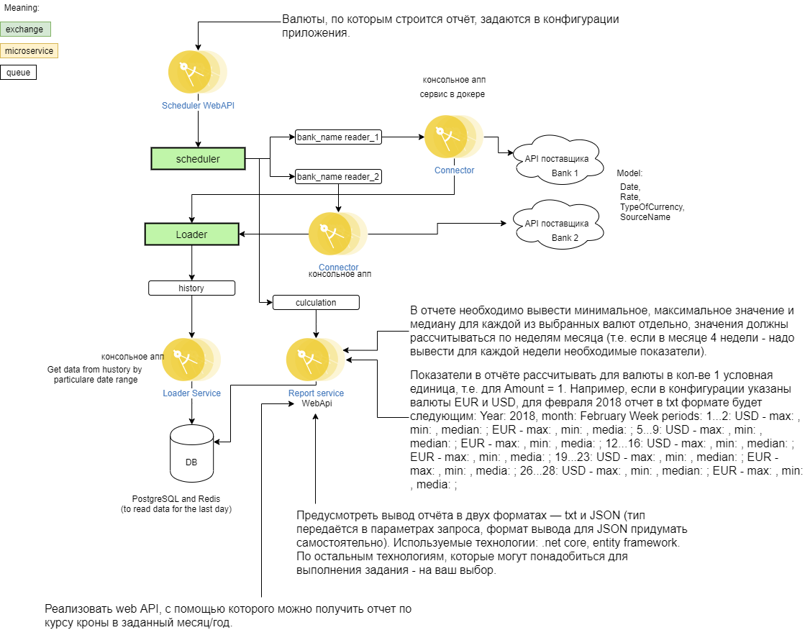

# Tracking the exchange rate of the Czech crown
# Solution architecture
Scheme   
  
Source in drawio [Architecture](./UpdatedArchitecture.drawio) 
Czech National Bank provides the ability to track the exchange rate of the Czech crown 
A daily course is available at https://www.cnb.cz/en/financial_markets/foreign_excha..
Historical data is available at  https://www.cnb.cz/en/financial_markets/foreign_excha..
It is necessary to develop a system consisting of components:
1) A separate console application for filling the database with exchange rate data for 2019 and 2020 (Rate column in CNB reports).
2) A scheduled task that saves the current course in the database. The start period is set up in the configuration.
3) Implement a web API, with which you can get a report on the crown exchange rate in a given month / year. In the report, you must display the minimum, maximum value and median for each of the selected currencies separately, the values ​​must be calculated by weeks of the month (i.e. if there are 4 weeks in a month, you must display the necessary indicators for each week). The currencies used to build the report are set in the application configuration. Calculate the indicators in the report for a currency in a quantity of 1 conventional unit, i.e. for Amount = 1.
For example, if the configuration specifies the currencies EUR and USD, for February 2018 the report in txt format will be as follows: 
Year: 2018, month: February
Week periods:
1...2: USD - max: , min: , median: ; EUR - max: , min: , media: ;
5...9: USD - max: , min: , median: ; EUR - max: , min: , media: ;
12...16: USD - max: , min: , median: ; EUR - max: , min: , media: ;
19...23: USD - max: , min: , median: ; EUR - max: , min: , media: ;
26...28: USD - max: , min: , median: ; EUR - max: , min: , media: ;
Provide the output of the report in two formats - txt and JSON (the type is passed in the request parameters, the output format for JSON must be invented by yourself).
Technologies used: .net core, entity framework. For the rest of the technologies that may be needed to complete the assignment - your choice. 
Heroku https://ozexchangerate.herokuapp.com/ 

### Basic services:
#### BTBСonnector
Service for downloading data from BTB Bank. Implements a console application for downloading / receiving data from remote (BTB Bank).
[Readme](./Services/BTBConnector/Readme.md)
#### Loader
Service collects data from different suppliers and converts them to the required type for storage in a database. Implements a console application with methods for getting, transforming, saving data to a database. 
[Readme](./Services/Loader/Readme.md)
#### ReportApi 
Service for providing data to the user by currency. Implements API and logic for issuing reports in two formats(txt,json) for a specific period.
[Readme](./Services/ReportApi/Readme.md)
#### Scheduler 
Service for creating scheduled tasks. Implements API and logic for adding / editing scheduled tasks 
[Readme](./Services/Scheduler/Readme.md)
